# Creating Microservices for account and loan 

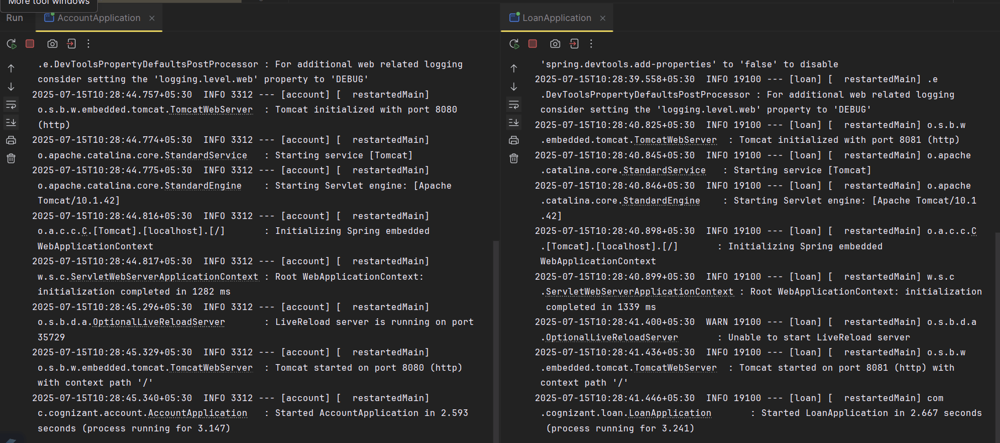

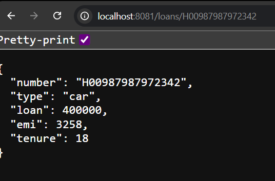

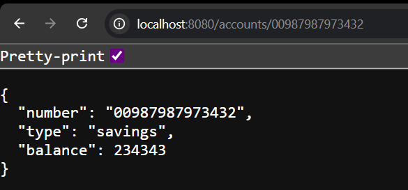

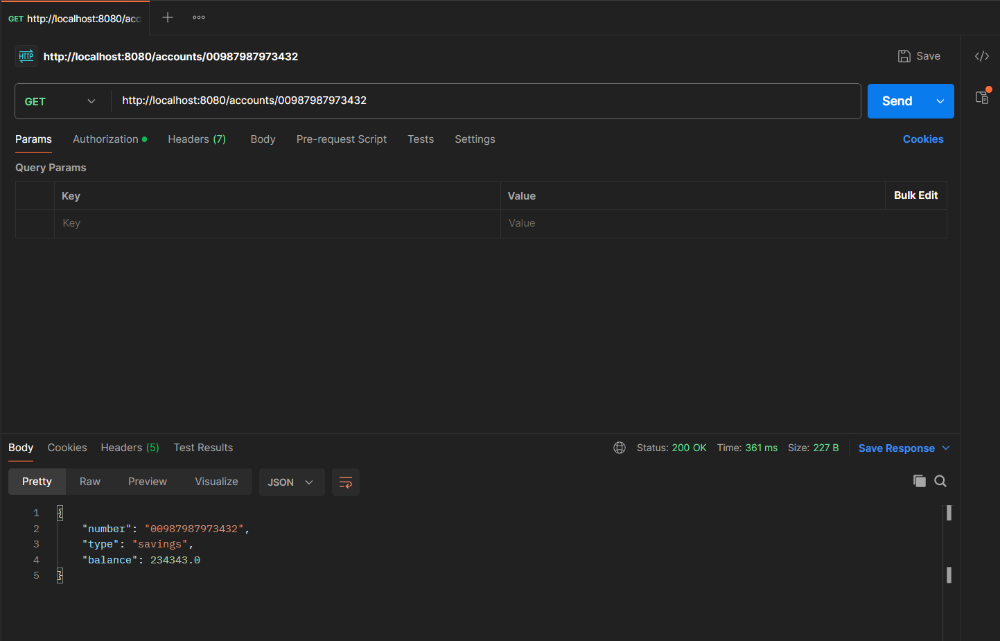

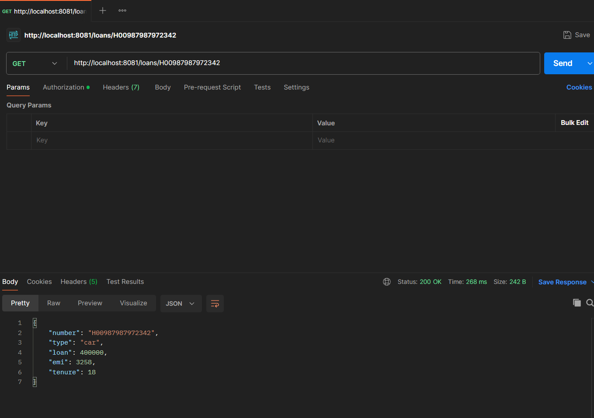

# Create Eureka Discovery Server and register microservices

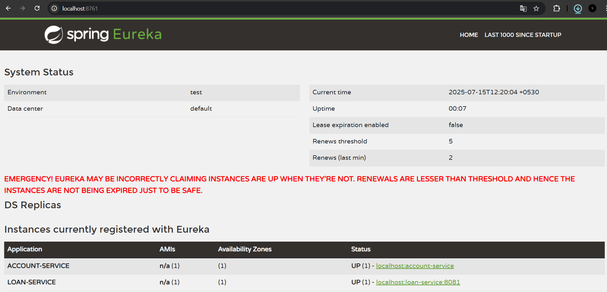

# Create a Spring Cloud API Gateway and call one microservice thru the API gateway. Configure a global filter to log each request targeting the microservice using Spring Cloud API Gateway.

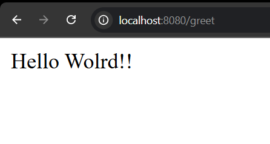

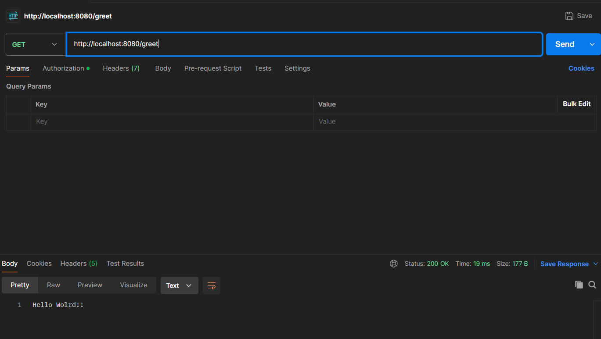

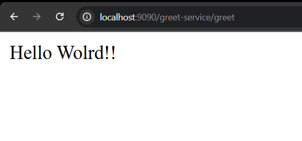

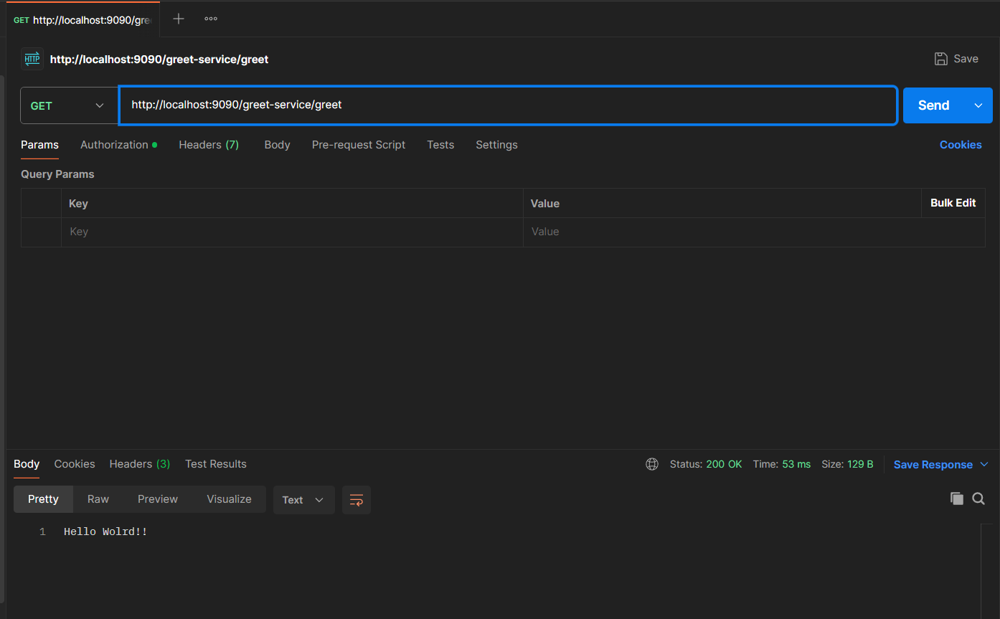

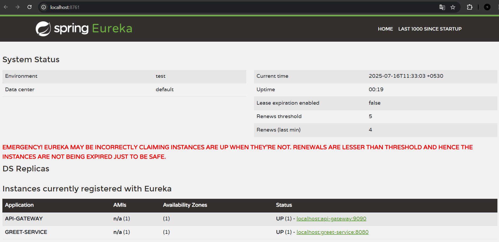

